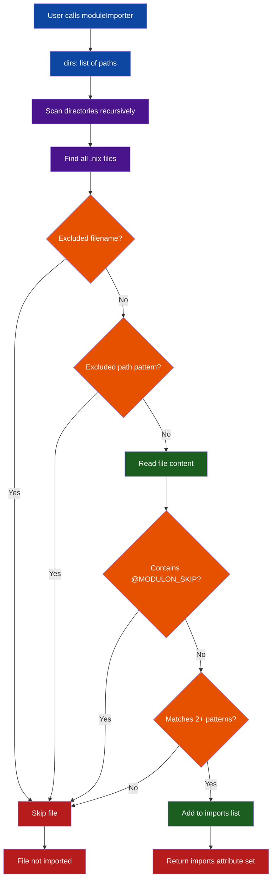

# How Modulon Works

Modulon solves a common problem in NixOS configurations: managing a growing number of module files without manually updating import lists. It automatically discovers and imports Nix modules by analyzing file content, not just file extensions.

## Module Discovery Flow



## Key Benefits

- **Automatic Discovery** — Add new modules without updating import lists
- **Content-Based Detection** — Identifies real modules by analyzing content patterns, avoiding accidental imports of non-module `.nix` files
- **Flexible Configuration** — Easily specify directories to scan and paths/patterns to exclude
- **Works Everywhere** — Compatible with NixOS, Home Manager, and other Nix module systems

## The Discovery Process

The core of Modulon is a library function available via `modulon.lib.<system>`. When called, this function:

1. Recursively scans the directories specified in the `dirs` option for files ending in `.nix`
2. Excludes files matching patterns in `excludePaths` or default excluded filenames
3. Reads the content of the remaining `.nix` files
4. Checks if the file content contains at least **2 or more** common module definition patterns
5. Returns an attribute set `{ imports = [ ... ]; }` containing the paths to the files identified as modules

## Module Detection Patterns

Modulon identifies modules by looking for these patterns in file content:

```nix
modulePatterns = [
  "... }:"
  "}:"
  "config,"
  "lib,"
  "inputs,"
  "nixosConfig,"
  "pkgs,"
  "config = {"
  "home = {"
  "imports = ["
  "options."
];
```

A file must match **at least 2 patterns** to be considered a module. This reduces false positives from files that happen to contain a single pattern.

## Error Handling

If a directory specified in `dirs` doesn't exist, Modulon will fail with a clear error message:

```
Modulon: Directory '/path/to/dir' does not exist
```
